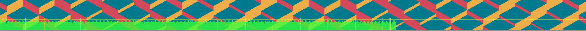

# DR Frame Timer

Single file library intended for use with [DragonRuby](https://dragonruby.org/).

DR Frame Timer shows a small graph of elapsed frame time, over time.



## Installation

Preferred install is via DragonRuby builtin [download_stb_rb](https://docs.dragonruby.org/#-----download_stb_rb(_raw)-)

First, download the lib, using the DragonRuby Console:

```
$gtk.download_stb_rb_raw "https://raw.githubusercontent.com/owenbutler/dr-frame-timer/refs/heads/main/frame-timer.rb", "app/lib/frame-timer.rb"
```

This will download the lib to `app/lib/frame-timer.rb`

Include the following in your `main.rb`:

```
require 'app/lib/frame-timer.rb'
```

## Usage

Minimal example:

```ruby
require 'app/lib/frame-timer.rb'

$frame-timer = FrameTimer.new

def tick args
  $frame_timer.start_tick(args)

  # ...

  $frame_timer.end_tick(args)
end
```

## Configuration

### Dev Mode/Production

By default, the Frame Timer and graph are enabled in dev mode and disabled in Production.

You can start disabled via config:

```ruby
frame-timer = FrameTimer.new(start_disabled: true)
```

You can also disable/enable/toggle the graph at any point:

```ruby
frame-timer.enable()
frame-timer.disable()
frame-timer.toggle()
```

### Customisation

You can configure the following attributes of the graph, via the corresponding arguments to the constructor

- `graph_scale: 3` - Scale the height of the graph.
- `graph_width: 1280` - How wide the graph spans.
- `graph_x: 0` - The starting bottom left x co-ordinate of the graph.
- `graph_y: 0` - The starting bottom left y co-ordinate of the graph.
- `graph_alpha: 200` - How transparent the graph is rendered.
